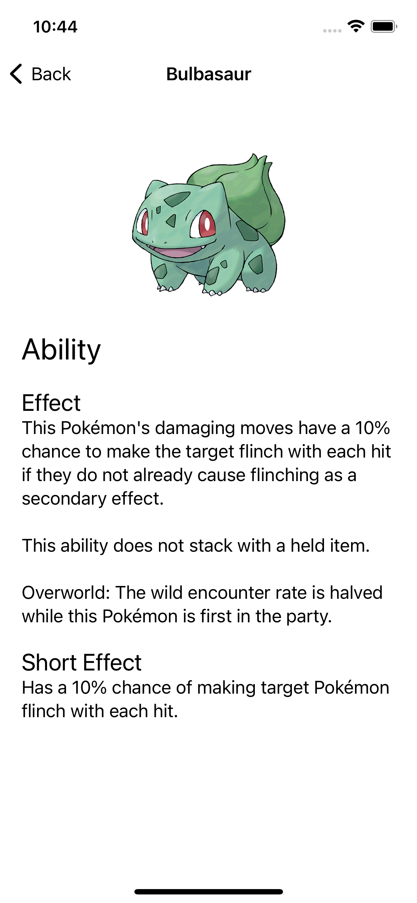
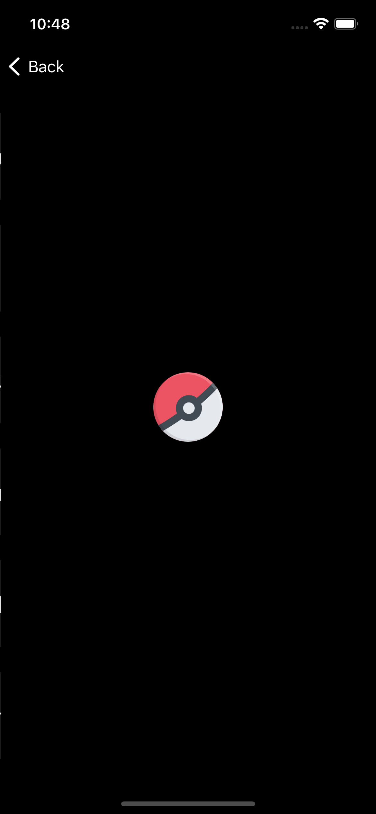

# ViperSession
Ejemplo de App iOS Swift implementando patrón de arquitectura VIPER

Utilizando:

* [Alamofire](https://github.com/Alamofire/Alamofire)
* [AlamofireImage](https://github.com/Alamofire/AlamofireImage)
* [Lottie](https://github.com/airbnb/lottie-ios)

Dark Mode:

